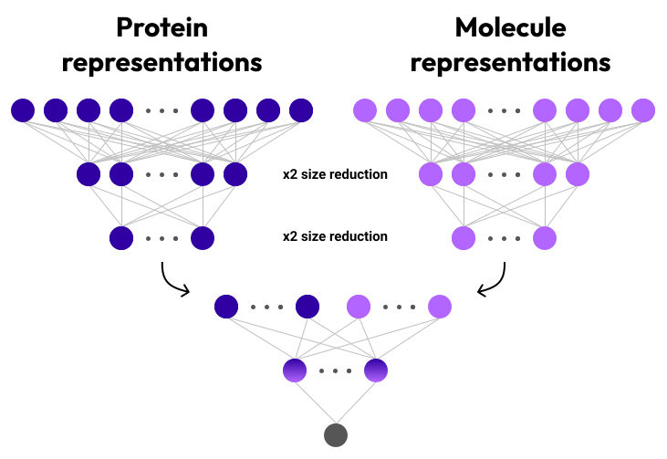

# Protein-Metabolite Interaction Classification

This project focuses on classifying interacting/non-interacting pairs of proteins and small molecules using simple neural network and highly informative embeddings from pre-trained models as input. Those include **[ProtT5](https://github.com/agemagician/ProtTrans?tab=readme-ov-file)** and **[AlphaFold2](https://github.com/google-deepmind/alphafold)** representations of proteins, **[MolecularTransformer](https://github.com/mpcrlab/MolecularTransformerEmbeddings)** and Morgan fingerprints representations of chemicals. You can make a prediction with a model pre-trained on ProtT5+Morgan representations, or train a model yourself on any representations (see notebooks below). The project is implemented using PyTorch and PyTorch Lightning, and training experiments are tracked with Weights & Biases (W&B).


## Table of Contents
- [Limitations](#limitations)
- [Getting Started](#getting-started)
- [Model Architecture](#model-architecture)
- [Using Docker for Local Setup](#using-Docker-for-Local-Setup)
- [Parameters](#parameters)
- [Data and model availability](#data-availability)
- [Contributing](#contributing)
- [LICENSE](#license)


## Limitations
The model is only available for proteins with single peptide chains. It should be also noted that the length of proteins used for training was no more than 1000 residues. However, the prediction can be made for proteins of any length as embeddings with fixed shapes are used. 

## Getting Started

### **Reproduce the experiment**

1. Open the **[Reproduce the experiment](https://colab.research.google.com/drive/1iXF5kaBAN-kw2K2TBXxfaJqLqhdfexWK?usp=sharing)** notebook.

2. Make a copy of the notebook to your own Google Drive:
    - Click on `File` -> `Save a copy in Drive`.

3. Follow the instructions within the notebook to train the model.

### **Make a prediction**

The model, provided here for making predictions, uses ProtT5 protein embeddings and Morgan fingerprints of chemicals as input. 

1. Open the **[Make predictions](https://colab.research.google.com/drive/1qQVgUTXtOQ7zyH6bHB0X16tY1O6nPO94?usp=sharing)** notebook.

2. Make a copy of the notebook to your own Google Drive:
    - Click on `File` -> `Save a copy in Drive`.

3. Follow the instructions within the notebook to predict possibility of protein-ligand interaction. The notebook uses code from [embed_ProtT5.ipynb](https://colab.research.google.com/drive/1TUj-ayG3WO52n5N50S7KH9vtt6zRkdmj?usp=sharing#scrollTo=QMoeBQnUCK_E) from **[ProtTrans Github repository](https://github.com/agemagician/ProtTrans?tab=readme-ov-file)**. The parameters are as follows: `per_residue = False`, `per_protein = True` and `sec_struct = False`. The output array has size of 1024. 

## Model Architecture

We used a simple MLP classifier. After each layer batch normalization and ReLU activation function was applied. To produce labels, sigmoid function was used.




## Parameters

### General Parameters

- `morgan_fp`: (boolean) Use Morgan fingerprints for molecular representation.
- `learning_rate`: (float) Learning rate for the optimizer.
- `epochs`: (int) Number of training epochs.
- `project`: (string) W&B project name.
- `weight_decay`: (float) Weight decay for the optimizer.
- `batch_size`: (int) Batch size for data loading.

### Model-Specific Parameters

- `input_size_protein`: (int) Size of the input feature vector for proteins.
- `input_size_molecule`: (int) Size of the input feature vector for molecules.
- `fc1_layer_size_factor`: (int) Factor to reduce the size after the first fully connected layer.
- `fc2_layer_size_factor`: (int) Factor to reduce the size after the second fully connected layer.
- `dropout_rate`: (float) Dropout rate applied after each layer.

### AF2 Model-Specific Parameters

- `single_size`: (int) Size of the single input feature vector.
- `pair_size`: (int) Size of the pair input feature vector.
- `msa_size`: (int) Size of the MSA input feature vector.
- `molecule_size`: (int) Size of the molecule input feature vector.

## Using Docker for Local Setup
You can also use Docker to run the project locally. This can be useful if you prefer not to use Google Colab or need a local environment for testing and development.

### Prerequisites
Docker must be installed on your local machine. If you are not familiar with docker, here is a set of installation tutorials depending on your system:

[Docker installation for Windows](https://www.youtube.com/watch?v=ZyBBv1JmnWQ)

[Docker installation for Mac OS](https://www.youtube.com/watch?v=-EXlfSsP49A)

[Docker installation for Linux](https://www.youtube.com/watch?v=J3nyufLvk1A)

### Building the Docker Image
To obtain the `docker` folder, clone the repository using Git and then navigate to the directory:

```git clone https://github.com/katyachemistry/PLI_prediction.git```

```cd PLI_prediction/docker```

Get the dataframe.pkl **[here](https://drive.google.com/drive/folders/1u9DwSNje2gX-N0QgxxFFHanw705gH29N?usp=sharing)** and put it in the "docker" folder.

Run the following command:

```docker build -t pli .```

### Running the Docker Container
Once the Docker image is built, you can run the container with the following command:

```docker run -it --rm pli /bin/bash```

This command will start the container and give you an interactive terminal. 

#### Usage within Docker
After running the container, you can use it similarly to how you would in a notebook environment. 

#### Example Commands
**Training**

If you want to reproduce the experiment, run the following:

```python reproduce_the_experiment.py --project my_project --protein-reps prott5```

- project (required): Name of the project for W&B. In case you don't have an account, you can register

- protein-reps PROTEIN_REPS (required): Type of representations for proteins. prott5 or af2

- molecule-reps (optional): Type of representations for molecules. morgan for Morgan Fingerprints or moltr for MolecularTransformer (default morgan)

- epochs (optional): Set the number of epochs for training. Default is 1

- batch-size (optional): Define the batch size for training. Default is 32.

- learning-rate (optional): Specify the learning rate for the optimizer. Default is 0.001.

- weight-decay (optional): Set the weight decay parameter for regularization. Default is 0.0001.

- dropout-rate (optional): Define the dropout rate for regularization. Default is 0.01.

- fc1-layer-size-factor (optional): Set the size factor for the first fully connected layer. Default is 2.

- fc2-layer-size-factor (optional): Set the size factor for the second fully connected layer. Default is 2.

Additionally, you can train the model using your own ProtTrans and AlphaFold2 embeddings, provided they have the same dimensionality (for AlphaFold2 reps it is achieved through averaging along axes). Ensure that these embeddings are stored in a way similar to the dataframe.pkl file included in this repository (column names and pickle filename should be the same). 

**Making predictions**

Predictions are made by the model trained on ProtT5 and Morgan fingerprints embeddings.
There are two ways for making predictions. You can obtain ProtT5 embedding beforehand and put it to the root directory (an example h5 file is given). Or you can make a seamless prediction, but consider that ProtT5 model of >2 GB will be downloaded. 
Example usage for the first option:

`python make_prediction.py --smiles "C(C(=O)O)C(CC(=O)O)(C(=O)O)O" --protein_name ppa --path_to_protT5_h5 "./ppa_prott5_embedding.h5"`

Example usage for the second option:

```python make_prediction_seamless.py --smiles "C(C(=O)O)C(CC(=O)O)(C(=O)O)O" --sequence "MSALLRLLRTGAPAAACLRLGTSAGTGSRRAMALYHTEERGQPCSQNYRLFFKNVTGHYISPFHDIPLKVNSKEENGIPMKKARNDEYENLFNMIVEIPRWTNAKMEIATKEPMNPIKQYVKDGKLRYVANIFPYKGYIWNYGTLPQTWEDPHEKDKSTNCFGDNDPIDVCEIGSKILSCGEVIHVKILGILALIDEGETDWKLIAINANDPEASKFHDIDDVKKFKPGYLEATLNWFRLYKVPDGKPENQFAFNGEFKNKAFALEVIKSTHQCWKALLMKKCNGGAINCTNVQISDSPFRCTQEEARSLVESVSSSPNKESNEEEQVWHFLGK" --protein_name "ppa"```


#### Stopping the Docker Container
Open new terminal. Get a list of docker containers:

```docker ps```

Copy ID of the pli container you need to stop. Run:

```docker stop <container_id>```

## Data and model availability
Data and model can be found **[here](https://drive.google.com/drive/folders/1u9DwSNje2gX-N0QgxxFFHanw705gH29N?usp=sharing)**. 

## Contributing

Contributions are welcome! Please open an issue or submit a pull request for any improvements or bug fixes.

## LICENSE
The source code for the site is licensed under the MIT license, which you can find in the MIT-LICENSE.txt file.
